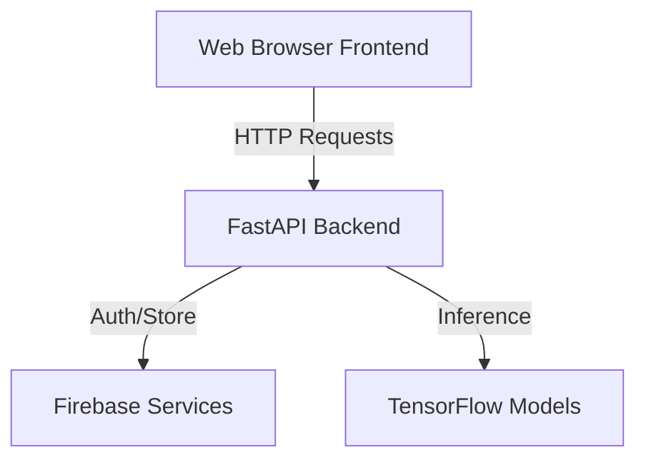

# Architecture Documentation

AgriCrop is built as a modular, decoupled full-stack application.

## System Overview

## Backend Modules

1. **API Router**: Exposes versioned endpoints (`/api/v1/...`) and routes traffic to the appropriate controller.
2. **AI Inference Layer**: Handles raw file preprocessing, loads TensorFlow models, and runs predictions. Supports stub fallback.
3. **Database Adapter (Firebase)**: Uses Firebase Admin SDK to perform CRUD operations on Firestore collections and store leaf images in Cloud Storage.

## Frontend Architecture

- **Static Pages**: Multi-page site styled with Bootstrap 5 and custom glassmorphism styling.
- **API Client (`js/api.js`)**: A wrapper around browser `fetch` implementing token attachment, error handling, and structured response formats.
- **Firebase Auth (`js/auth.js`)**: Handles user session monitoring and reauthentication flows.
